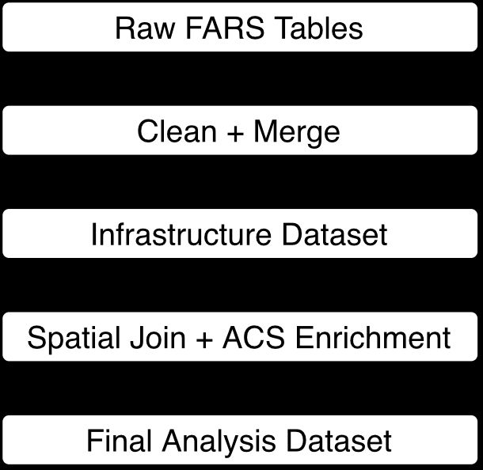
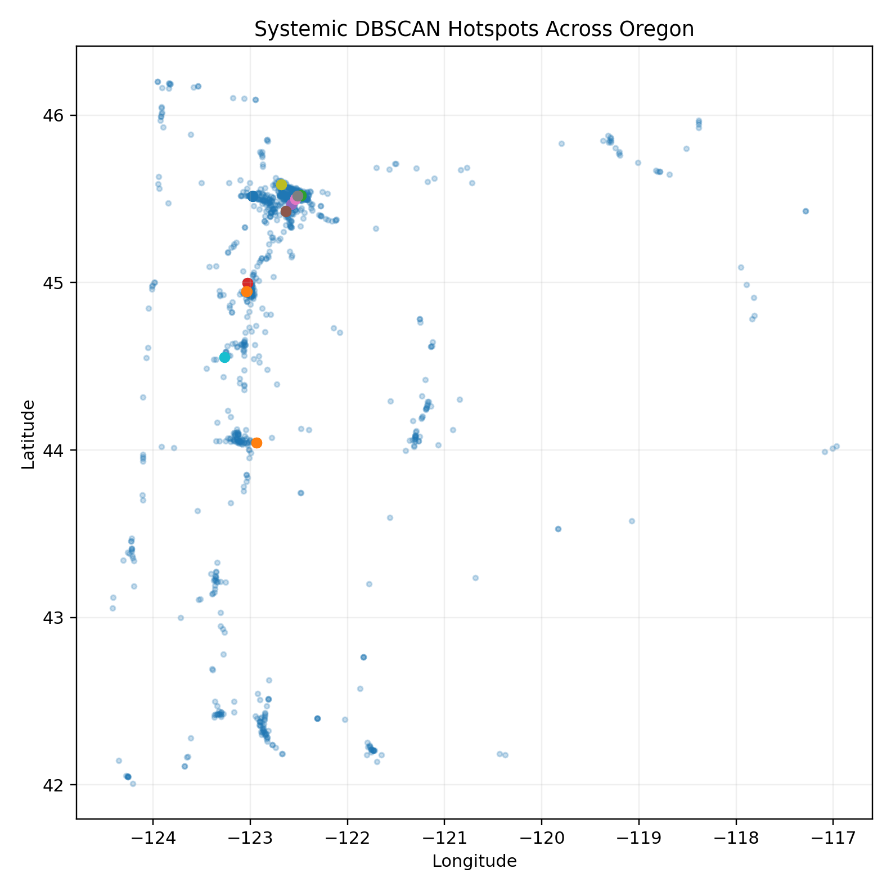
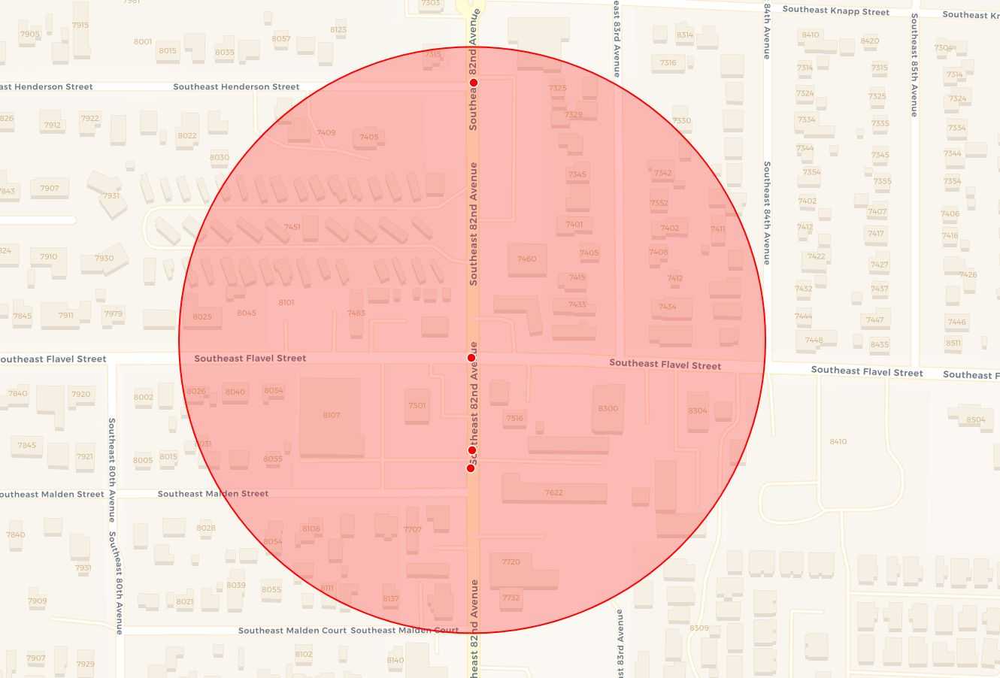
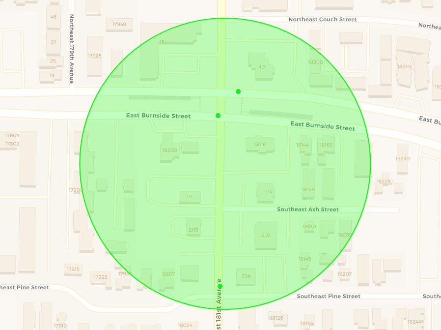
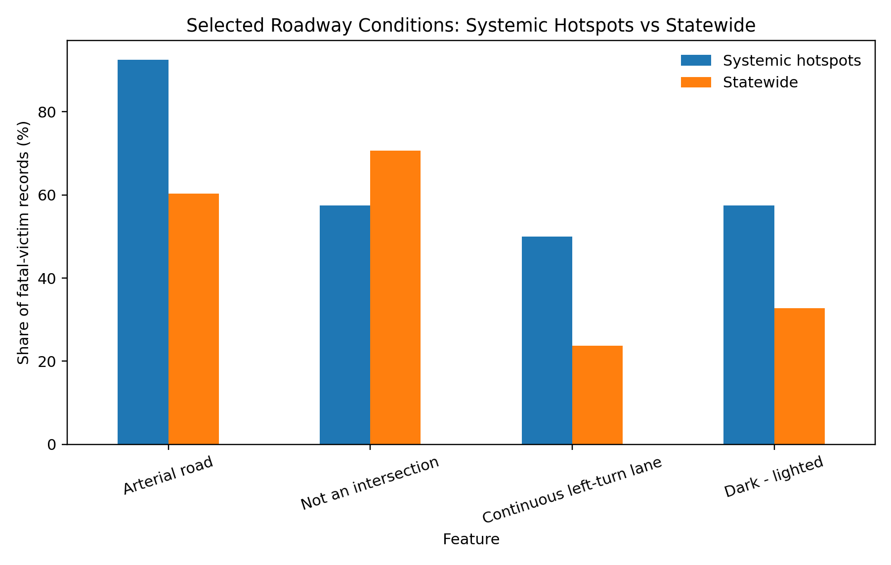
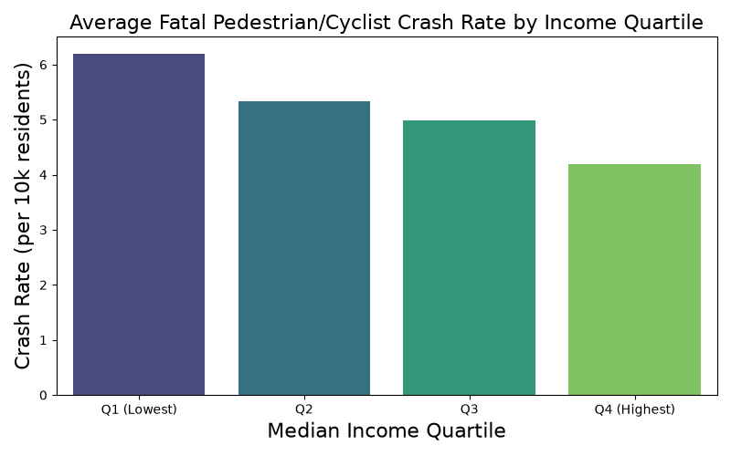
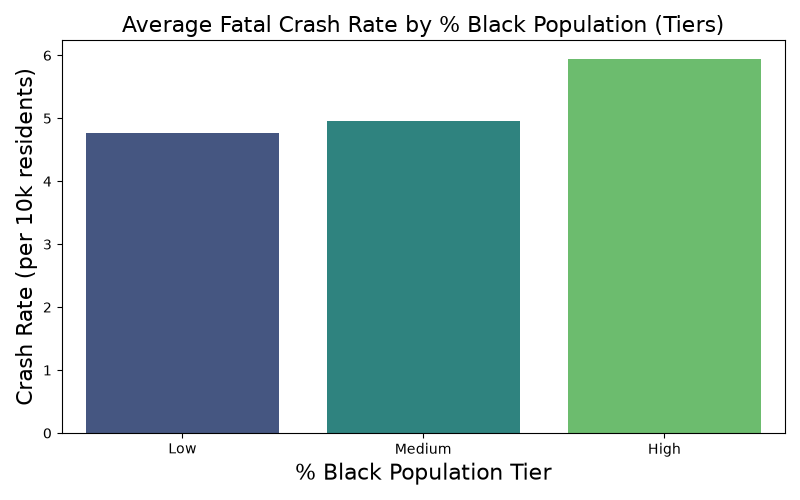

# Title, Team, and Affiliations

**Project title:** *Fatal Pedestrian and Cyclist Crash Risk Factors in Oregon: A Spatial Analysis (2015–2024)*

| Team member | Project role | Email |
|---|---|---|
| Simon Thompson | Owner Product Lead; data engineering and spatial analysis | sthompson2@willamette.edu |
| Rohan Srinivasa Babu | Statistical analysis, interpretation, and communication | rsrinivasababu@willamette.edu |

**Peer Stakeholder Product Owners**

| Peer stakeholder | Role | Email |
|---|---|---|
| Aiyana Brown | Peer Stakeholder Product Owner | acbrown2@willamette.edu |
| Amaya Supancich-McCord | Peer Stakeholder Product Owner | asupancichmccord@willamette.edu |
| Seira Ramchandani | Peer Stakeholder Product Owner | sramchandani@willamette.edu |

**Affiliation:** DATA 510 Data Science Capstone, Willamette University, Summer 2026  
**Repository:** <https://github.com/S1mT/data510-OregonPedSafety>

# Abstract

Fatal pedestrian and cyclist crashes are not distributed evenly across Oregon. This project uses 2015–2024 records from the National Highway Traffic Safety Administration's Fatality Analysis Reporting System (FARS), enriched with U.S. Census Bureau American Community Survey (ACS) data, to examine where fatal non-motorist crashes concentrate and which roadway, environmental, temporal, and community characteristics are associated with them. A reproducible two-stage data pipeline integrates five annual FARS tables, assigns crash coordinates to Oregon Census tracts, and appends tract-level demographic and commuting measures. The final dataset contains 1,049 fatal pedestrian and cyclist victim records representing 490 unique crashes. DBSCAN identified 15 candidate spatial clusters using a 0.1-mile neighborhood radius and at least three fatal-victim records; filtering to locations containing at least two distinct crash incidents produced 11 systemic hotspots containing 40 fatal-victim records across 32 unique incidents. These hotspots were disproportionately concentrated on arterial roads and two-way roads with continuous left-turn lanes. Among tracts represented in the crash data, fatal-crash rates were weakly but significantly associated with lower median income, higher Black population share, and higher transit/walking commute share. The results are descriptive rather than causal and are intended to help transportation agencies prioritize corridors and communities for closer local investigation, additional data collection, and targeted safety investment.

# Introduction: Problem and Research Questions

## Problem statement

Pedestrians and cyclists are among the most physically vulnerable users of the transportation system. When a collision occurs, they have little protection from vehicle mass and speed. Fatal crashes may also reflect recurring patterns in road design, lighting, speed environment, location, and surrounding community conditions. Identifying those patterns can help transportation agencies move from reacting to individual crashes toward prioritizing locations for further safety investigation and investment.

FARS provides a standardized national census of police-reported motor-vehicle traffic crashes involving at least one fatality [@nhtsaFARS]. This project focuses specifically on fatal pedestrian and cyclist crashes in Oregon between 2015 and 2024. The analysis combines crash circumstances, infrastructure variables, spatial clustering, and Census tract context to describe both where fatalities concentrate and what characteristics are common in those locations.

## Research questions

**Primary research question:** Which environmental, roadway, and temporal factors are most strongly associated with fatal pedestrian and cyclist crashes in Oregon between 2015 and 2024?

**Secondary research question:** Are fatal pedestrian and cyclist crashes disproportionately concentrated in Oregon communities with particular demographic or socioeconomic characteristics between 2015 and 2024?

## Changes since the M1 proposal

The original charter focused on the Salem area. After data acquisition and validation, the geographic scope was expanded to statewide Oregon. The statewide FARS extract offered a more complete and analytically useful sample while preserving the project's transportation-safety purpose. The title was also revised to remove the phrase *predictive analysis*. A supervised predictive model was ultimately not included because the dataset contains only crashes involving at least one fatality and therefore lacks a defensible non-fatal or no-crash comparison group. Training a model to predict fatality from a fatal-only sample would create an ill-defined target and could produce misleading performance claims. The final analysis instead emphasizes spatial clustering, descriptive infrastructure profiling, and tract-level statistical associations.

# Impact and Stakeholders

**Pedestrians and cyclists** are the primary affected stakeholders because they bear the direct safety consequences of hazardous roadway conditions. The project does not assign individual responsibility for crashes; instead, it examines recurring system-level patterns that may indicate locations requiring closer review.

**The Oregon Department of Transportation (ODOT)** is a potential user of the findings because it administers statewide transportation-safety programs and seeks to reduce crashes involving people walking and biking [@odotBikePed]. Statewide hotspot and infrastructure patterns may help guide screening, data collection, and prioritization, but they should not replace site-specific engineering analysis.

**City and county transportation planners** may use the results to identify corridors where local roadway geometry, traffic control, lighting, crossing design, or land-use context should be examined. The analysis is intended to narrow the field of locations for investigation rather than prescribe a single intervention.

**Public-health organizations and community advocates** may use the findings to support injury-prevention and transportation-equity discussions. Because tract-level demographic variables describe neighborhoods rather than crash victims, the equity analysis must be interpreted carefully and should not be used to stigmatize communities.

The peer stakeholder group's shared theme is data-driven prediction of community and urban outcomes. Their perspective encouraged the team to connect technical analysis to realistic policy uses, limitations, and equity implications rather than treating analytical output as an end in itself.

# Related Work and Background

FARS is maintained by NHTSA as a nationwide census of fatal motor-vehicle traffic crashes. It provides annual crash-, vehicle-, and person-level files as well as specialized pedestrian and bicyclist information [@nhtsaFARS; @nhtsaFARSManual]. Because it includes only crashes meeting the fatality criterion, FARS is appropriate for studying the circumstances of fatal crashes but cannot independently estimate the probability that any roadway user, trip, or location will experience a crash.

Transportation-safety research frequently combines crash records with geographic analysis to identify high-density locations and recurring roadway conditions. DBSCAN is a density-based clustering algorithm designed to identify clusters of irregular shape while distinguishing isolated observations as noise [@ester1996]. These properties make it useful for exploratory hotspot detection because fatal crash locations do not necessarily form circular or administratively bounded groups.

The ACS provides annually released social, economic, housing, and demographic estimates, including five-year estimates for Census tracts [@censusACS5]. This project uses tract-level ACS measures to add neighborhood context to fatal crash locations. The resulting variables should be interpreted as characteristics of the surrounding tract, not as attributes of individual victims.

Oregon's pedestrian and bicycle planning framework emphasizes safety, equity, accessibility, connectivity, and strategic investment [@odot2016plan]. This project contributes to that broader planning context by combining statewide fatal-crash records, localized hotspot identification, infrastructure profiling, and tract-level demographic analysis in one reproducible workflow.

# Data and Data Engineering

## Data sources

| Source | Role in the project | Coverage and access |
|---|---|---|
| NHTSA Fatality Analysis Reporting System (FARS) | Crash, person, pedestrian/bicyclist, vehicle, weather, temporal, roadway, and coordinate variables | Annual national CSV files, 2015–2024; U.S. government public data [@nhtsaFARS] |
| U.S. Census Bureau TIGER/Line tract boundaries | Spatially assigns each valid crash coordinate to an Oregon Census tract | 2020 Oregon Census tract shapefile |
| 2022 ACS 5-year estimates | Median income, population, racial/ethnic composition, and transit/walking commute measures | Census API; tract-level estimates [@censusACS2022] |

## Scope and unit of observation

The final analysis-ready dataset contains **1,049 fatal pedestrian and cyclist victim records**, representing **490 unique Oregon crashes** from 2015 through 2024. It contains **38 variables** and no duplicate rows. The unit of observation is an individual fatal non-motorist victim, not a unique crash. Multiple victims can therefore share the same `ST_CASE` crash identifier.

| Victim type | Records |
|---|---:|
| Pedestrian | 881 |
| Bicyclist | 124 |
| Personal conveyance / other pedalcyclist | 44 |
| **Total** | **1,049** |

## Relational structure and keys

The source data are highly normalized. The engineering pipeline uses the following identifiers:

- `ST_CASE`: unique crash identifier;
- `VEH_NO`: vehicle identifier within a crash;
- `PER_NO`: person identifier within a crash;
- `STR_VEH`: striking-vehicle number recorded for the non-motorist;
- `GEOID`: Census tract identifier added during spatial enrichment.

The raw FARS tables are joined in the following sequence:

1. `person.csv` and `pbtype.csv` are inner-joined using `STATE`, `STATENAME`, `ST_CASE`, `VEH_NO`, and `PER_NO` to create the victim-level base.
2. `accident.csv` is left-joined by `STATE`, `STATENAME`, and `ST_CASE` to append crash-level location, environmental, temporal, and roadway context.
3. Multiple weather records for the same crash are collapsed into a pipe-separated value and then left-joined by crash key.
4. The victim's `STR_VEH` is matched to `vehicle.csv`'s `VEH_NO` within the same `ST_CASE` to retrieve speed-limit, traffic-control, and trafficway variables associated with the striking vehicle.

## Reproducible pipeline

The data pipeline has two stages. In Stage 1, `data/scripts/initial.py` reads annual national FARS files from `data/raw/`, standardizes column names, filters Oregon records using `STATE = 41`, writes annual Oregon-specific interim tables, performs the relational joins described above, concatenates all years, and exports `data/processed/FARSinfrastructure.csv`.

In Stage 2, `data/scripts/enrich.py` filters invalid placeholder coordinates, converts valid crash records to a GeoDataFrame, downloads Oregon Census tract boundaries, and performs a point-in-polygon spatial join. It then queries the 2022 ACS five-year API for income, population, race/ethnicity, transit, and walking-commute variables. Census suppression codes are converted to missing values, tract-level percentages are calculated, and the ACS data are joined by `GEOID` to create `data/processed/FARSmaster.csv`.

{#fig-pipeline width=55%}

## Data-quality findings

The project identified several important data-quality constraints.

| Variable | Not reported | Share of records |
|---|---:|---:|
| Traffic control device | 593 | 57% |
| Speed limit | 248 | 24% |
| Weather | 132 | 13% |

Many source-data gaps are represented by standardized labels such as `None / Unknown` or `Not Reported` rather than true null values. These labels are retained because they reflect information unavailable in the original records rather than a processing failure. The final dataset includes 863 urban records, 185 rural records, and one record without a reported urban/rural classification. Victim ages range from 1 to 95, with a mean of 48.9 and a median of 50.

# Ethics and Responsible Use

## Privacy and consent

The project uses public government records and does not contain direct personal identifiers, names, addresses, or protected health information. FARS represents victims through anonymous identifiers such as `ST_CASE` and `PER_NO`. Census measures are aggregated to the tract level and do not identify individual households.

## Scope and undercoverage

FARS includes only crashes involving at least one fatality. The dataset therefore cannot describe all pedestrian and cyclist crashes, near misses, or underlying travel exposure. Findings should be framed as patterns among recorded fatal crashes rather than total pedestrian or cyclist risk.

## Ecological interpretation

ACS variables describe the Census tract surrounding each crash location. They do not establish the income, race, ethnicity, or travel behavior of the victim. Interpreting tract-level associations as individual-level relationships would be an ecological fallacy.

## Fairness and potential harms

Historical infrastructure investment, enforcement, reporting practices, and travel patterns may differ across communities. A map that labels a neighborhood as a hotspot could stigmatize residents or encourage enforcement-heavy responses without addressing roadway design. Results should therefore be used to support equitable investigation, community engagement, and infrastructure review rather than to assign blame.

## Non-causal framing

The study is observational. DBSCAN identifies spatial concentration, feature summaries describe common conditions, and correlations measure linear association. None of these methods independently establish that a roadway or demographic feature caused a fatal crash. Exposure, traffic volume, land use, and other unmeasured factors may confound observed relationships.

# Methods and Evaluation

## Analytical design

The final analysis uses three complementary approaches:

1. **Spatial clustering** to identify localized concentrations of fatal crashes;
2. **Infrastructure profiling** to compare roadway conditions inside systemic hotspots with statewide fatal-crash records;
3. **Tract-level demographic analysis** to examine relationships between fatal crash rates and community characteristics.

The analysis does not include a supervised predictive model. Because every observation comes from a fatal crash, the dataset lacks a valid negative class or exposure denominator from which to model the probability of fatal-crash occurrence. A predictive model trained only on fatal cases would not answer the research question and could imply predictive validity that the available data do not support.

## Spatial clustering with DBSCAN

`data/scripts/DBSCAN.py` applies DBSCAN to latitude and longitude coordinates using the Haversine distance metric. The final specification uses a neighborhood radius of **0.1 miles (approximately 161 meters)** and `min_samples = 3`, meaning that at least three fatal-victim records must fall within the local neighborhood to form a candidate cluster. The poster rounded the radius to approximately 200 meters for presentation.

Because multiple victims may come from the same crash, candidate clusters were then passed to `data/scripts/hotspot_profiler.py` and filtered to retain only clusters containing **at least two distinct `ST_CASE` crash incidents**. This second step distinguishes repeated-location patterns from a single multi-fatality event. The combination produced **15 candidate DBSCAN clusters** and **11 systemic hotspots**.

Parameter sensitivity was examined around the final specification. Holding `min_samples = 3`, a 0.075-mile radius produced 8 systemic hotspots containing 26 fatal-victim records, the final 0.1-mile radius produced 11 hotspots containing 40 records, and a 0.125-mile radius produced 19 hotspots containing 67 records. At the final 0.1-mile radius, increasing `min_samples` from 3 to 4 reduced the result to 3 systemic hotspots containing 16 records. These checks show that the exact hotspot inventory is parameter-dependent; the chosen specification should therefore be interpreted as a screening rule for compact recurring locations rather than a uniquely correct partition of Oregon crash risk.

The complete systemic hotspot inventory is shown below. `Radius_Meters` is the maximum Haversine distance from each cluster centroid to its furthest included record, plus a 20-meter display buffer used by the mapping script.

| Internal cluster ID | Unique crash incidents | Fatal-victim records | Years represented | Display radius (m) |
|---:|---:|---:|---|---:|
| 3 | 4 | 4 | 2016, 2017, 2018, 2024 | 163.1 |
| 1 | 3 | 3 | 2015, 2019, 2023 | 123.6 |
| 2 | 3 | 3 | 2016, 2019, 2020 | 44.3 |
| 4 | 3 | 3 | 2015, 2016 | 145.8 |
| 7 | 3 | 3 | 2017, 2020, 2021 | 97.5 |
| 8 | 3 | 3 | 2017, 2018, 2022 | 36.4 |
| 9 | 3 | 3 | 2017, 2022, 2024 | 31.8 |
| 10 | 3 | 3 | 2018, 2019, 2020 | 47.4 |
| 11 | 3 | 3 | 2019, 2022 | 91.1 |
| 12 | 2 | 7 | 2021, 2022 | 140.2 |
| 0 | 2 | 5 | 2015, 2020 | 81.6 |

Across these 11 hotspots there are **40 fatal-victim records representing 32 unique crash incidents**, or **3.8% of the 1,049 fatal-victim records** in the final dataset.

## Infrastructure profiling

For each systemic hotspot, `data/scripts/hotspot_profiler.py` records the most common value for roadway and environmental variables including urban/rural classification, functional system, trafficway type, posted speed limit, intersection type, traffic control, lighting, weather, and pedestrian position. The pooled systemic-hotspot records are then compared with all 1,049 statewide fatal-victim records.

The comparison is descriptive. It identifies roadway conditions that are more common within the selected hotspots than in the statewide fatal-crash dataset, but it does not estimate independent causal effects or adjust for roadway mileage, traffic volume, or pedestrian/cyclist exposure.

## Tract-level demographic analysis

`data/scripts/DemographicAnalysis.py` aggregates `FARSmaster.csv` by Census tract. The numerator is the number of **unique fatal crash incidents (`ST_CASE`)** in each represented tract, and the denominator is tract population:

$$
\text{Fatal crash rate per 10,000 residents}
=
\frac{\text{Unique fatal crash incidents}}{\text{Tract population}}
\times 10{,}000
$$

The analysis table contains 491 Census tracts represented in the crash data; 489 tracts have complete values across the five demographic predictors and are used in the Pearson correlation analysis. The predictors are median household income, percentage White, percentage Black, percentage Hispanic, and percentage of commuters who walk or use public transit.

For visual comparisons, median income is divided into quartiles using the observed tract distribution: Q1 = $23,765–$57,399; Q2 = $57,553–$70,572; Q3 = $70,594–$85,806; and Q4 = $85,950–$193,846. Black population share is divided into tertiles: Low = 0–0.154%, Medium = 0.158–1.410%, and High = 1.423–27.109%. These categories are descriptive quantile groupings, not policy thresholds.

Five Pearson correlations were tested. The report presents two-sided p-values and 95% confidence intervals. As a conservative multiple-testing check, a Bonferroni-adjusted significance level of 0.01 (`0.05 / 5`) was also considered.

## Evaluation strategy

The project evaluates results through internal consistency rather than predictive accuracy. Spatial outputs are checked for plausible geographic concentration and compared with the underlying incident records. Hotspot profiles are compared against statewide feature prevalence so that common statewide conditions are not automatically treated as hotspot-specific. Demographic findings are reported with effect sizes, p-values, confidence intervals, and a multiple-testing check. Across all analyses, interpretation is constrained to association and screening rather than causal attribution.

# Results and Visualizations

## Statewide spatial pattern and hotspot examples

DBSCAN produced 15 candidate clusters under the final 0.1-mile, three-record specification. After requiring at least two distinct crash incidents, 11 systemic hotspots remained. These hotspots contain 40 fatal-victim records across 32 unique crash incidents. Although this is a small share of the statewide victim records, the clusters identify compact locations where fatal incidents recur across different years rather than one-time multi-victim events.

{#fig-statewide-hotspots width=75%}

Two Portland-area examples illustrate the recurrence pattern. The Southeast 82nd Avenue hotspot contains four unique crash incidents and four fatalities occurring in 2016, 2017, 2018, and 2024 within an approximately 163-meter display radius. The Southeast 181st Avenue hotspot contains three unique incidents and three fatalities occurring in 2015, 2019, and 2023 within an approximately 124-meter display radius. Their separation across multiple years is why the poster described them as recurring or reactivated locations rather than isolated events.

{#fig-82nd width=75% fig-pos="H"}

{#fig-181st width=75% fig-pos="H"}

## Infrastructure profile of systemic hotspots

The pooled hotspot profile shows several conditions that differ from the statewide fatal-crash dataset. **Arterial roads** account for 92.5% of systemic-hotspot records compared with 60.4% statewide. **Two-way roads with a continuous left-turn lane** account for 50.0% of hotspot records compared with 23.7% statewide. **Dark but lighted conditions** also appear more often within hotspots (57.5%) than statewide (32.8%).

By contrast, **non-intersection locations** account for 57.5% of hotspot records but 70.6% statewide. This is an important qualification: non-intersection crashes are common in the fatal-crash dataset generally and are not uniquely elevated within the identified hotspots.

{#fig-infrastructure width=78%}

| Feature | Systemic hotspots | Statewide |
|---|---:|---:|
| Arterial road | 92.5% | 60.4% |
| Not at an intersection | 57.5% | 70.6% |
| Two-way road with continuous left-turn lane | 50.0% | 23.7% |
| Dark – lighted | 57.5% | 32.8% |

The differences are most useful as screening signals. Arterial classification and continuous center left-turn lanes stand out as recurring features of the retained hotspots, but without roadway mileage and travel exposure the analysis cannot determine whether those road types are intrinsically more dangerous or simply carry more traffic and pedestrian activity.

## Demographic correlations

The final tract-level Pearson results are shown below.

| Tract characteristic | r | 95% CI | p-value | Interpretation |
|---|---:|---|---:|---|
| Percent Black | 0.184 | [0.097, 0.269] | <0.001 | Weak positive |
| Percent transit/walking commuters | 0.143 | [0.055, 0.229] | 0.0015 | Weak positive |
| Median income | -0.136 | [-0.222, -0.047] | 0.0027 | Weak negative |
| Percent White | -0.077 | [-0.164, 0.012] | 0.0898 | Not significant |
| Percent Hispanic | 0.008 | [-0.081, 0.096] | 0.8675 | Not significant |

With five tests, the Bonferroni-adjusted threshold is `p < 0.01`. The associations with Black population share, transit/walking commute share, and median income remain below this conservative threshold; White and Hispanic population shares do not. All three statistically significant coefficients are nevertheless small in magnitude, so statistical significance should not be confused with a large substantive effect.

The grouped income comparison is directionally consistent with the correlation result. Average fatal crash rates decline from **6.19 per 10,000 residents** in the lowest-income quartile to **4.19 per 10,000** in the highest-income quartile. The middle quartiles average 5.33 and 4.98 per 10,000, respectively.

{#fig-income width=68%}

The Black population-share chart shows average rates of **4.77**, **4.96**, and **5.94** per 10,000 residents across the low, medium, and high tertiles, respectively. This pattern is consistent with the positive correlation, but it remains a neighborhood-level association and does not identify the race of individual crash victims or establish a causal mechanism.

{#fig-black width=68%}

# Discussion, Limitations, and Future Work

## Interpretation

The final results support a consistent descriptive story. Fatal pedestrian and cyclist crashes are geographically dispersed across Oregon, but a subset recur in compact locations across multiple years. Eleven systemic hotspots remain after separating repeated crash locations from candidate DBSCAN clusters that could be driven by a single multi-fatality incident. Within those hotspots, arterial classification and continuous center left-turn lanes are substantially more prevalent than in the statewide fatal-crash dataset, while dark-but-lighted conditions are also more common.

The results do **not** support the simpler claim that every common hotspot feature is overrepresented. Non-intersection locations, for example, are common within hotspots but even more common statewide. This comparison illustrates why the statewide baseline is necessary: raw frequency within hotspots alone cannot distinguish a hotspot-specific pattern from a condition that is already common among fatal crashes generally.

The demographic analysis also provides evidence of neighborhood-level disparities, but the relationships are weak. Lower median income is associated with a higher fatal crash rate, while Black population share and transit/walking commute share are positively associated with the rate. These relationships remain statistically significant under a conservative Bonferroni check, yet their small effect sizes and the observational design make them better suited to prioritizing further investigation than to drawing causal conclusions.

Taken together, the spatial, infrastructure, and demographic results point toward a screening framework: identify recurring fatal-crash locations, characterize the roadway environments around them, and incorporate neighborhood context when deciding where deeper local analysis and safety investment may be warranted.

## Limitations

**Fatal-only outcome.** FARS excludes non-fatal crashes and locations with no reported fatal crash. The project therefore characterizes fatal-crash patterns rather than estimating the probability that a person, trip, or roadway segment will experience a crash.

**Lack of exposure denominators.** The dataset does not contain pedestrian counts, cyclist counts, roadway mileage, or vehicle miles traveled. A location or tract may record more fatal crashes partly because more people travel through it.

**Crash-represented tract universe.** The demographic table is constructed from `FARSmaster.csv`, so it contains tracts represented by at least one fatal crash record rather than every Oregon tract, including zero-crash tracts. The correlation results should therefore be interpreted within this observed-crash tract universe.

**Missing roadway information.** Traffic-control and speed-limit variables contain substantial `Not Reported` values. This reduces confidence in feature-prevalence estimates and may introduce systematic reporting bias.

**Victim-versus-crash unit.** The spatial dataset contains one row per fatal victim. Multi-victim crashes can therefore create candidate density clusters. The systemic-hotspot filter mitigates this by requiring at least two unique `ST_CASE` incidents, but pooled feature percentages still describe victim records rather than equal-weighted crash events.

**Spatial precision and parameter dependence.** Coordinate errors and geocoding precision can affect cluster membership. The sensitivity checks also demonstrate that changing the DBSCAN radius or minimum-sample threshold changes the number of detected hotspots. The 0.1-mile specification is a practical screening choice rather than a uniquely correct spatial scale.

**ACS timing and uncertainty.** The project applies 2022 ACS five-year tract estimates to crashes spanning 2015–2024. Neighborhood conditions may have changed during the study period, and ACS sampling uncertainty is not propagated into the correlation analysis.

**Ecological fallacy and confounding.** Tract demographics cannot be attributed to individual victims. Income, race/ethnicity, commute patterns, urban density, roadway design, transit availability, and exposure may be interrelated. The observed correlations do not isolate the effect of any one factor.

## Future work

The strongest next step is to add comparison and exposure data rather than increasing model complexity on the current fatal-only sample. Future work should incorporate non-fatal pedestrian and cyclist crashes, pedestrian and bicycle counts, vehicle volumes, roadway mileage, posted and operating speeds, lane counts, crossing infrastructure, and historical roadway changes. These additions would allow the project to distinguish high use from unusually high risk and would support stronger regression or predictive designs.

Spatial work could also be extended by testing hotspot stability across a wider parameter grid, applying road-network-constrained clustering rather than straight-line distance alone, and comparing hotspot locations with local engineering inventories. For the equity analysis, including all Oregon Census tracts—including zero-fatal-crash tracts—and incorporating ACS uncertainty would provide a stronger population-level comparison.

# Conclusions and Recommendations

Fatal pedestrian and cyclist crashes in Oregon show meaningful spatial concentration rather than a uniform statewide pattern. The final analysis identifies **11 systemic hotspots** containing repeated crash incidents across multiple years. These hotspots are disproportionately represented on arterial roads and two-way roads with continuous left-turn lanes, while the demographic analysis finds weak but statistically significant associations between fatal crash rates and lower median income, higher Black population share, and higher transit/walking commute share.

For ODOT and local transportation agencies, the immediate value of this work is **screening and prioritization** rather than causal diagnosis. Three recommendations follow from the evidence:

1. **Conduct corridor-level safety reviews of recurring arterial hotspots.** Reviews should examine speed environment, crossing distance, lighting, lane configuration, center-turn-lane design, transit access, and pedestrian/cyclist desire lines.
2. **Collect exposure and infrastructure data before selecting interventions.** Pedestrian, cyclist, and vehicle volumes are necessary to distinguish high use from unusually high risk and to support stronger comparative analysis.
3. **Apply an equity-centered review process.** Neighborhood-level demographic signals should prompt deeper investigation, community engagement, and infrastructure review—not assumptions about individual victims or enforcement-heavy responses.

The central takeaway is that statewide fatal-crash data can identify recurring locations and roadway conditions that deserve closer attention, but responsible action requires combining these screening signals with local engineering evidence, exposure measures, and community knowledge.

# Reproducibility and References

## Repository workflow

The final repository separates processing, analysis, and outputs. Core scripts are located under `data/scripts/`:

| Script | Purpose | Main output |
|---|---|---|
| `initial.py` | Extract Oregon records and integrate FARS relational tables | `data/processed/FARSinfrastructure.csv` |
| `enrich.py` | Spatial join to Census tracts and ACS enrichment | `data/processed/FARSmaster.csv` |
| `DBSCAN.py` | Final Haversine DBSCAN clustering | `data/processed/FARSclusters.csv` |
| `hotspot_profiler.py` | Systemic-hotspot filtering and feature profiles | `systemic_hotspots_incidents.csv`, `systemic_hotspots_profile.csv` |
| `interactive_map_generator.py` | Interactive hotspot maps | HTML maps in `data/processed/` |
| `DemographicAnalysis.py` | Tract aggregation, correlations, and grouped charts | demographic statistics and figures |

From the repository root, the core analytical sequence is:

```bash
python data/scripts/initial.py
python data/scripts/enrich.py
python data/scripts/DBSCAN.py
python data/scripts/hotspot_profiler.py
python data/scripts/interactive_map_generator.py
python data/scripts/DemographicAnalysis.py
```

The first stage requires the annual FARS national folders for 2015–2024 under `data/raw/`. `enrich.py` also requires a Census API key. Before public portfolio release, the key should be supplied through an environment variable or local configuration rather than committed directly in source code.

## Environment and dependencies

A pinned `requirements.txt` is provided at the repository root. Install the Python environment with:

```bash
python -m pip install -r requirements.txt
```

The pinned environment includes pandas, GeoPandas, Shapely, NumPy, scikit-learn, SciPy, Folium, matplotlib, seaborn, requests, and Jupyter. Quarto is additionally required to render this report.

## Reproduce the write-up

From the repository root:

```bash
quarto render deliverables/M5-final-poster-and-writeup/final-writeup.qmd
```

The report embeds final poster figures where they already existed and adds static summary figures generated from the final processed data. The interactive HTML hotspot maps remain available under `data/processed/` for location-level inspection.

# References

::: {#refs}
:::
